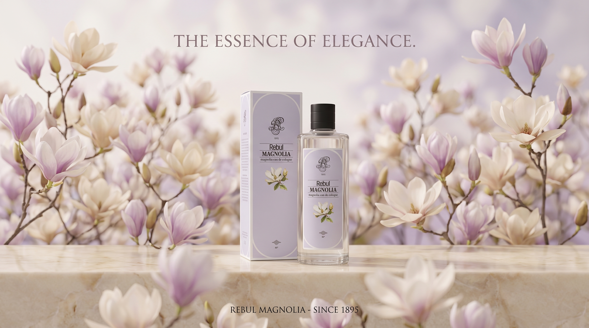
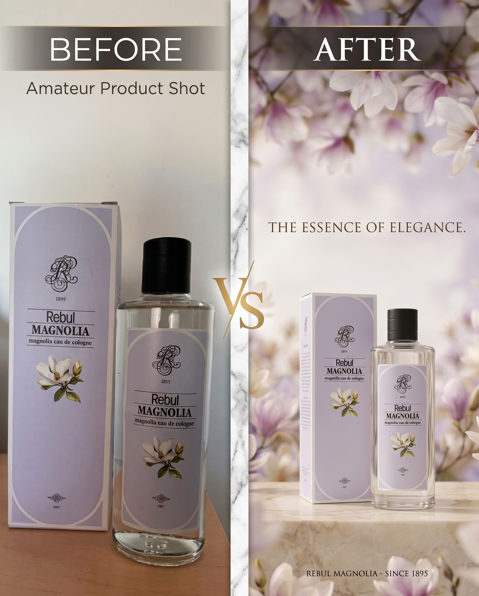

# 🌸 AI Product Photography — Rebul Magnolia

> Transforming a raw smartphone photo into a professional luxury fragrance advertisement using AI tools.

## Screenshots




---

## 📸 Before & After

| Before | After |
|--------|-------|
| Raw smartphone photo | AI-generated luxury ad |




---

## Project Overview

This project demonstrates the full workflow of converting an amateur product photo into a professional marketing visual using AI-powered tools — without any professional camera, studio, or Photoshop.

**Type:** AI Product Photography & Marketing Visual  
**Category:** Freelance Portfolio — AI Content Creation  
**Format:** Social Media Ready (Instagram, Web)

---

## ⚙️ Tools Used

| Tool | Purpose |
|------|---------|
| **ChatGPT (Image Generation)** | AI background & scene generation |
| **Canva** | Layout, formatting, Before/After composition |
| **Smartphone Camera** | Original product photo |

---

## Process

**Step 1 — Product Photography**
Captured the Rebul Magnolia perfume bottle and box with a smartphone camera under natural window lighting.

**Step 2 — AI Image Generation**
Used ChatGPT to generate a professional luxury product advertisement scene with the following prompt style:
```
Professional luxury perfume advertisement, soft floral background, 
pale cream and lavender tones, delicate magnolia flowers blurred 
in background, elegant soft studio lighting, marble surface, 
high-end fragrance ad style, square format 1:1
```

**Step 3 — Format Adaptation**
Adapted the final visual into platform-ready formats using Canva:
- Instagram Post → 1080 x 1080 px (1:1)
- Instagram Story → 1080 x 1920 px (9:16)
- Web Banner → 1200 x 628 px (16:9)

**Step 4 — Before/After Composition**
Created a side-by-side Before/After comparison to clearly demonstrate the transformation.

---

## Deliverables

- ✅ AI-generated luxury product advertisement (1:1)
- ✅ Instagram Story format (9:16)
- ✅ Web Banner format (16:9)
- ✅ Before/After comparison visual

---

## 💡 Key Skills Demonstrated

- AI Prompt Engineering
- Product Photography (smartphone)
- Background Generation
- Aspect Ratio & Format Adaptation
- Brand Consistency
- Social Media Content Creation

---
